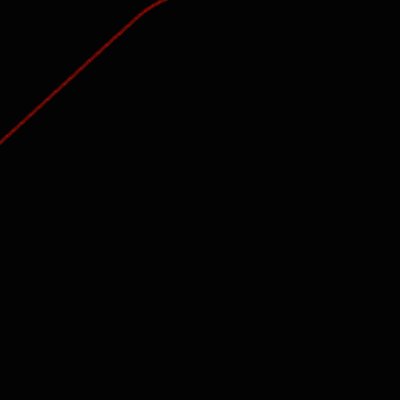

# DeltaTime
The aim of this project was to create a framerate independent physics simulation using delta time and substepping.

## Theory
Framerate independent physics aims to simulate the physics at a constant rate regardless of the fps. If the simulation was dependent on the framerate, any slow down in performace would cause the simulation to slow down as well. We can solve this issue by using delta time.
Delta time simply means the change in time between two events, in this case physics updates which I shall now refer to as ticks.
```
|<     One Second      >|
I   I   I   I   I   I   I   = 7 Frames  => ~143 ms per frame
I  I  I  I  I  I  I  I  I   = 9 Ticks   => ~111 ms per tick
```
In this example the framerate is running slower than the desired tickrate. `Δt = 143 ms`. We cant quite fit two tick into one frame so we have to keep track of the remaining time after a tick has occured. `offset = 143 - 111 = 32 ms`. We can keep a running total of this offset time so that as soon as we can fit two ticks into `Δt + offset` two ticks will occur instead of one. This starts to look something like this...
```
|<     One Second      >|
I   I   I   I   I   I   I   = 7 Frames  => ~143 ms per frame
I   I   I   II  I   I   II  = 9 Ticks   => theoretical ~111 ms per tick
```
Now in order to catch up, on some frames two ticks need to happen at once. If instead the framerate was quicker that the tickrate, on some frames there would be no ticks.

Using c++ we can make a function like this to keep track of delta time:
```cpp
// Calculate delta time
int deltaTime(int previous, int offset) {
    int Δt = (clock() - previous);  // Δt = Current time - time of last frame
    return Δt;             
}

// Main loop
while (true) {
    // Calculate delta time
    int delta = deltaTime(ptime, offset);
    ptime = clock(); // Current time becomes time of last frame

    // -  Do stuff here  - //
}
```
This delta time can then be used in kinematic equations to calculate changes in velocity, position, etc. However another option is to use substepping. This is where we carry out each physic tick as a single transaction.
In c++ this would look something like this:
```c++
// Main loop
while (true) {
    // Calculate delta time, accounting for offset time
    int delta = deltaTime(ptime, offset) + offset; // Add offset since last tick
    ptime = clock(); // Current time becomes time of last frame

    // Do physics
    for (int i = 0; i < delta / tickRate; i++) {
        // -  Do stuff here  - //
        tick();
    }

    // Calculate the offset time
    offset = delta % tickRate; // Remainder of Δt/tickrate
}
```
Now each tick is occuring independently and in sequence.

In the demo below, simple projectile motion is being simulated with a different tickrate and framerate.


[Download Demo](https://github.com/greg-bt/DeltaTime/releases/tag/1.0)


    
